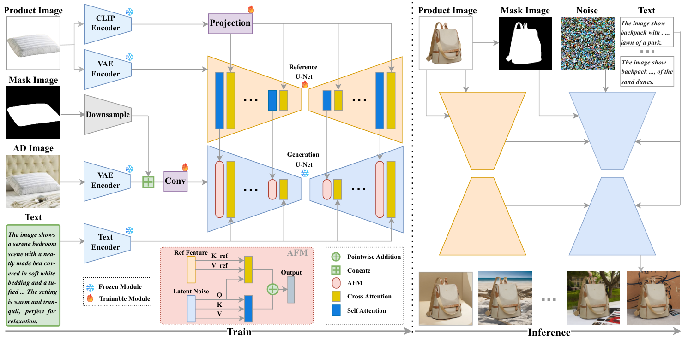
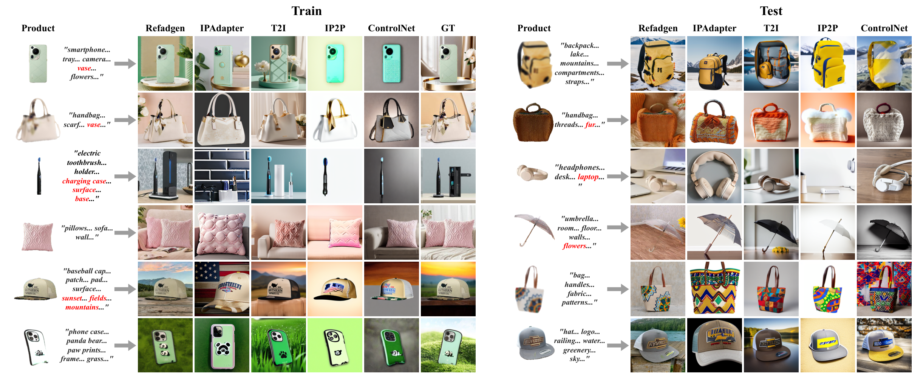

# RefAdgen - High-Fidelity Advertising Image Generation

## 1. Environment Setup

### 1.1 Hardware Requirements

#### GPU Requirements
- **Recommended Configuration**: NVIDIA GPU with CUDA support
- **Test Environment**: NVIDIA GeForce RTX 5090 D
  - VRAM: 32GB
  - CUDA Version: 13.0
  - Driver Version: 581.80

#### System Requirements
- **Memory**: Recommended 32GB or more
- **Storage**: Recommended 100GB or more available space (for models and datasets)

### 1.2 Software Requirements

#### Operating System
- Linux (Recommended Ubuntu 24.04+)
- Windows (WSL2)

#### Python Environment
- **Python Version**: 3.12.12
- **Conda**: For environment management

### 1.3 Conda Environment Configuration

#### Create and Activate Environment

```bash
# Create conda environment (if not already created)
conda create -n rdg_env python=3.12

# Activate environment
conda activate rdg_env
```

#### Packages/Plugins Installed in `rdg_env` Environment

##### Core Deep Learning Frameworks
```bash
# PyTorch and related libraries
torch==2.9.0+cu130
torchvision==0.24.0+cu130
```

##### Model and Inference Libraries
```bash
# Diffusers and related libraries
diffusers==0.35.2
transformers==4.57.1
accelerate==1.11.0
deepspeed==0.18.2
```

##### Image Processing
```bash
opencv-python==4.12.0.88
pillow==11.3.0
```

##### Data Processing
```bash
numpy==2.2.6
pandas==2.3.3
datasets==4.4.1
```

##### Model Dependencies
```bash
# GroundingDINO related
groundingdino==0.1.0  # Install from local: exteral_models/GroundingDINO

# SAM2 related
hydra-core==1.3.2
omegaconf==2.3.0
iopath==0.1.10
portalocker==3.2.0

# Other tools
timm==1.0.22
supervision==0.26.1
pycocotools==2.0.10
```

##### Other Dependencies
```bash
einops==0.8.1
huggingface-hub==0.36.0
safetensors==0.6.2
tqdm==4.67.1
```

#### Complete Installation Commands

```bash
# Activate environment
conda activate rdg_env

# Install PyTorch (CUDA 13.0)
pip install torch==2.9.0+cu130 torchvision==0.24.0+cu130 --index-url https://download.pytorch.org/whl/cu130

# Install core libraries
pip install diffusers==0.35.2 transformers==4.57.1 accelerate==1.11.0 deepspeed==0.18.2

# Install image processing libraries
pip install opencv-python==4.12.0.88 pillow==11.3.0

# Install data processing libraries
pip install numpy==2.2.6 pandas==2.3.3 datasets==4.4.1

# Install SAM2 dependencies
pip install hydra-core==1.3.2 omegaconf==2.3.0 iopath==0.1.10 portalocker==3.2.0

# Install other tools
pip install timm==1.0.22 supervision==0.26.1 pycocotools==2.0.10 einops==0.8.1

# Install GroundingDINO (from local source)
cd exteral_models/GroundingDINO
pip install -e .
cd ../..
```

##### Model checkpoints

- Download pretrained checkpoints from Hugging Face: [yiyun123/RefAdgen](https://huggingface.co/yiyun123/RefAdgen)

#### Verify Installation

```bash
# Check Python version
python --version  # Should display Python 3.12.12

# Check if CUDA is available
python -c "import torch; print(f'CUDA available: {torch.cuda.is_available()}')"

# Check key libraries
python -c "import diffusers, transformers, accelerate; print('Core libraries installed successfully')"
```

### 1.4 Environment Variable Configuration

```bash
# Set CUDA related environment variables (if needed)
export CUDA_VISIBLE_DEVICES=0
export TORCH_CUDA_ARCH_LIST="8.0;8.6;8.9;9.0"
```

### 1.5 SAM2 Installation

SAM2 must be installed so that Hydra can resolve the config name used by `build_sam2()`. The code references:
- `model_cfg = "configs/sam2.1/sam2.1_hiera_l.yaml"` which is loaded from the installed `sam2` package (e.g., `<site-packages>/sam2/configs/sam2.1/sam2.1_hiera_l.yaml`)
- The checkpoint is downloaded automatically from Hugging Face via `hf_hub_download` using `--sam2_repo_id` (default: `facebook/sam2.1-hiera-large`). No local checkpoint file is required.

Install SAM2 (choose one):
```bash
# Option A: Install from local source (recommended during development)
pip install -e /path/to/sam2

# Option B: Install from a Git URL (example)
pip install -e git+https://github.com/facebookresearch/segment-anything-2.git#egg=sam2
```

Configure repository (optional):
```bash
# You can override the repo via CLI or predict.sh:
# --sam2_repo_id="facebook/sam2.1-hiera-large"
# If you must run offline, manually place the checkpoint at the path you choose
# and modify the code to read from a local file.
```

If you prefer to keep the YAML config in this repository instead of relying on the installed package, you will need to extend Hydra's config search path to include your local directory, or modify the SAM2 loader to accept absolute file paths rather than Hydra config names.

### 1.6 Common Issues

#### GPU Related Issues
- **Issue**: `UserWarning: Failed to load custom C++ ops`
- **Solution**: This is a normal warning. The code will automatically use pure Python implementation with GPU support

#### Module Import Issues
- **Issue**: `ModuleNotFoundError: No module named 'xxx'`
- **Solution**: Ensure all dependencies are installed in the `rdg_env` environment

#### Path Issues
- **Issue**: Model files not found
- **Solution**: Check if model files exist in the `external_models/` or `exteral_models/` directories

---

## 2. Project Structure

```
RefAdgen/
├── data_provider/          # Data provider module
├── data_sources/           # Data source directory
├── experiments/            # Training and inference scripts
│   ├── train.py           # Training script
│   ├── predict.py         # Inference script
│   ├── train_utils.py     # Training utilities
│   └── predict_utils.py   # Inference utilities
├── external_models/        # External models directory
│   ├── GroundingDINO/     # GroundingDINO model
│   └── ...
├── jsons/                  # Configuration files
├── models/                 # Model definitions
├── outputs/                # Output directory (training checkpoints, generated images)
├── utils/                  # Utility functions
├── train.sh               # Training script
└── predict.sh             # Inference script
```

---

## 3. Paper Figures

The figures from the paper have been extracted from the PDF file and are shown below:

### 3.1 The overall model architecture of RefAdGen, featuring a decoupled dual U-Net design. The Generation U-Net receives the noisy latent and the product mask M' at its input for spatial control. At each level of the network, the Attention Fusion Module (AFM) fuses identity features from the Reference U-Net with the scene features of the Generation U-Net.



### 3.2 Qualitative comparisons on AdProd-100K. Prompts are simplified for clarity. Both the training samples on the left and the test samples on the right showcase the consistent advantages of RefAdGen in identity consistency, scene realism, and overall aesthetic quality.



**Note**: All figures have been extracted from the PDF file and saved in the `pdf/images/` directory. To view all extracted figures, please visit that directory.

---

## 4. Paper Tables

The tables from the paper are shown below:

### 4.1 30 categories and their sample counts.

| Category | Num | Category | Num | Category | Num |
|----------|-----|----------|-----|----------|-----|
| Backpack | 25000 | Eyeshadow | 13960 | Pens | 14650 |
| Bench | 21855 | Fork | 18115 | Pillows | 14595 |
| Body wash | 25000 | Foundation | 10715 | Rugs | 8760 |
| Bottle | 25000 | Handbag | 25000 | Shampoo | 22990 |
| Car | 25000 | Hats | 36740 | Snacks | 24990 |
| Cell phone | 25000 | Headphones | 22645 | Sneakers | 24995 |
| Chargers | 21095 | Kite | 13030 | Sports ball | 7045 |
| Clothing | 24995 | Lipstick | 10585 | Toothbrush | 7105 |
| Coffee | 24275 | Motorcycle | 24995 | Umbrella | 15675 |
| Cup | 16860 | Notebooks | 24995 | Wine glass | 24990 |

### 4.2 Hyperparameter configuration for the model.

| Hyperparameter | Value | Hyperparameter | Value |
|----------------|-------|----------------|-------|
| Optimizer | AdamW | Weight Decay | 0.01 |
| Batch Size | 3 | Learning Rate | 1×10⁻⁵ |
| Noise Offset | 0.05 | LR Scheduler | Linear |
| Training Epochs | 8 | Warmup Steps | 500 |

### 4.3 Performance comparison of our model (RefAdGen) against several baselines on five key metrics. The arrow indicates whether a higher value (↑) or a lower value (↓) is better. The **best** result in each column is highlighted in bold.

| Model | CLIP Score↑ | FID↓ | ImageReward↑ | MP-LPIPS↓ | LPIPS↓ |
|-------|-------------|------|--------------|-----------|--------|
| IP-Adapter | 32.6308 | 62.6666 | -0.2572 | 0.3974 | 0.7159 |
| T2I-Adapter | 34.2737 | 59.1770 | 0.1777 | 0.3382 | 0.6063 |
| InstructPix2Pix | 32.4433 | 64.1141 | -0.5842 | 0.3517 | 0.6336 |
| ControlNet | 33.0226 | 57.1835 | -0.3668 | 0.3748 | 0.6578 |
| **RefAdGen (Ours)** | **34.5106** | **50.5843** | **0.2391** | **0.2612** | **0.5487** |

### 4.4 Ablation study of our framework's core components and data strategy. "Full Model" represents our complete design, while each subsequent row ablates one key element. The results highlight the critical contributions of each component. The **best** score in each column is highlighted in bold.

| Configuration | CLIP Score↑ | FID↓ | ImageReward↑ | MP-LPIPS↓ | LPIPS↓ |
|---------------|-------------|------|--------------|-----------|--------|
| **Full Model (Ours)** | **34.5106** | **50.5843** | **0.2391** | **0.2612** | **0.5487** |
| w/o Masks | 33.2415 | 55.0244 | -0.2293 | 0.3638 | 0.6602 |
| w/o Dual Augmentation | 32.7952 | 68.7243 | -0.3554 | 0.3014 | 0.6064 |

### 4.5 Results of our user study comparing RefAdGen with baseline methods. The **best** score is highlighted in bold.

| | RefAdGen | ControlNet | IP2P | IP-Adapter | T2I |
|---|----------|------------|------|------------|-----|
| J2b | **38.70** | 23.60 | 8.40 | 0.90 | 28.40 |
| G2R | **90.70** | 77.30 | 47.30 | 6.70 | 78.00 |

---

## 5. Usage

### 5.1 Training

```bash
./train.sh
```

### 5.2 Inference

```bash
./predict.sh
```

### 5.3 Product extraction (GroundingDINO + SAM2)

- Input: an advertisement image (Ad Image) and its category label (`image_type`).
- Steps:
  - Use GroundingDINO to predict the product bounding box in the Ad Image based on `image_type`.
  - Use SAM2 with the predicted box as prompt to obtain the product segmentation mask.
  - Cut out the product from the Ad Image using the mask to form the Product Image (RGBA → RGB).
- Entry points:
  - `data_provider/BuildProduct` executes the full pipeline.
  - `experiments/predict_utils.py` calls `BuildProduct` during inference; no extra action needed when running `predict.sh`.
- Outputs:
  - Product images are saved under `data_sources/Product Image/`.
  - A mask tensor is produced and passed into the generation pipeline for spatial control.

---

## 6. Notes

1. Ensure all external models are downloaded and placed in their corresponding directories.
2. Confirm that a GPU is available during training and inference.
3. Checkpoints are saved at `outputs/checkpoint-{step}/pytorch_model/mp_rank_00_model_states.pt`.
4. Generated images are stored in the `outputs/{checkpoint}/images/` directory.

---

## 7. Version Information

- **Python**: 3.12.12
- **PyTorch**: 2.9.0+cu130
- **CUDA**: 13.0
- **Diffusers**: 0.35.2
- **Transformers**: 4.57.1

---

## 8. Citation

If you use this project, please cite the following paper:

**Paper Link**: [arXiv:2508.11695](https://arxiv.org/abs/2508.11695)

```bibtex
@article{chen2025refadgen,
  title={RefAdGen: High-Fidelity Advertising Image Generation},
  author={Chen, Yiyun and Yang, Weikai},
  journal={arXiv preprint arXiv:2508.11695},
  year={2025}
}
```

