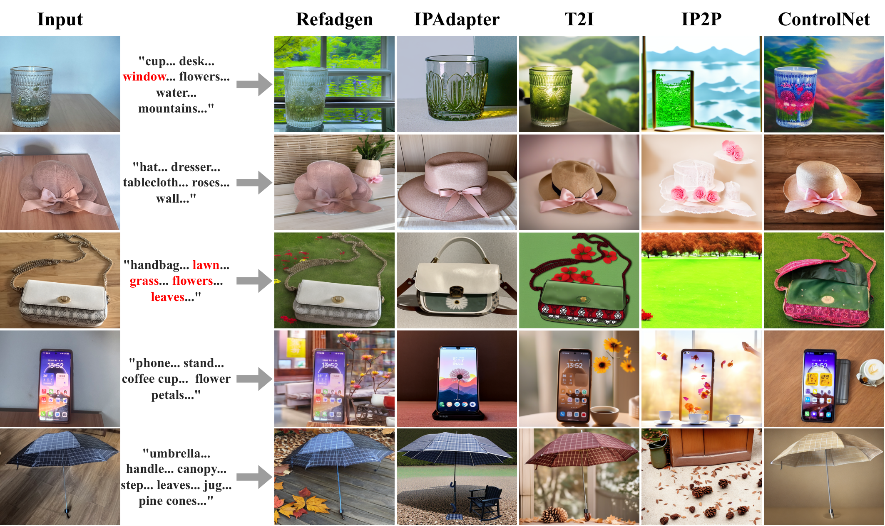
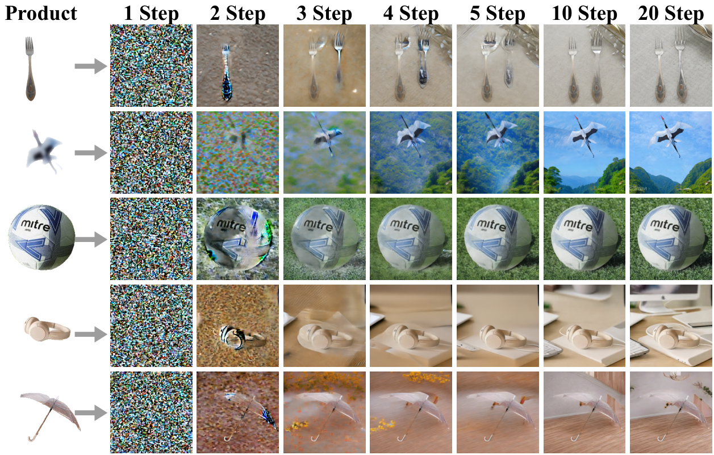

# RefAdgen - 广告图像生成系统

## 1. 环境部署

### 1.1 硬件要求

#### GPU 要求
- **推荐配置**：NVIDIA GPU，支持 CUDA
- **测试环境**：NVIDIA GeForce RTX 5090 D
  - 显存：32GB
  - CUDA 版本：13.0
  - 驱动版本：581.80

#### 系统要求
- **内存**：建议 32GB 以上
- **存储**：建议 100GB 以上可用空间（用于模型和数据集）

### 1.2 软件要求

#### 操作系统
- Linux (推荐 Ubuntu 24.04+)
- Windows (WSL2)

#### Python 环境
- **Python 版本**：3.12.12
- **Conda**：用于环境管理

### 1.3 Conda 环境配置

#### 创建和激活环境

```bash
# 创建 conda 环境（如果尚未创建）
conda create -n rdg_env python=3.12

# 激活环境
conda activate rdg_env
```

#### 在 `rdg_env` 环境中安装的插件/包

##### 核心深度学习框架
```bash
# PyTorch 和相关库
torch==2.9.0+cu130
torchvision==0.24.0+cu130
```

##### 模型和推理库
```bash
# Diffusers 和相关库
diffusers==0.35.2
transformers==4.57.1
accelerate==1.11.0
deepspeed==0.18.2
```

##### 图像处理
```bash
opencv-python==4.12.0.88
pillow==11.3.0
```

##### 数据处理
```bash
numpy==2.2.6
pandas==2.3.3
datasets==4.4.1
```

##### 模型依赖
```bash
# GroundingDINO 相关
groundingdino==0.1.0  # 从本地安装: exteral_models/GroundingDINO

# SAM2 相关
hydra-core==1.3.2
omegaconf==2.3.0
iopath==0.1.10
portalocker==3.2.0

# 其他工具
timm==1.0.22
supervision==0.26.1
pycocotools==2.0.10
```

##### 其他依赖
```bash
einops==0.8.1
huggingface-hub==0.36.0
safetensors==0.6.2
tqdm==4.67.1
```

#### 完整安装命令

```bash
# 激活环境
conda activate rdg_env

# 安装 PyTorch (CUDA 13.0)
pip install torch==2.9.0+cu130 torchvision==0.24.0+cu130 --index-url https://download.pytorch.org/whl/cu130

# 安装核心库
pip install diffusers==0.35.2 transformers==4.57.1 accelerate==1.11.0 deepspeed==0.18.2

# 安装图像处理库
pip install opencv-python==4.12.0.88 pillow==11.3.0

# 安装数据处理库
pip install numpy==2.2.6 pandas==2.3.3 datasets==4.4.1

# 安装 SAM2 依赖
pip install hydra-core==1.3.2 omegaconf==2.3.0 iopath==0.1.10 portalocker==3.2.0

# 安装其他工具
pip install timm==1.0.22 supervision==0.26.1 pycocotools==2.0.10 einops==0.8.1

# 安装 GroundingDINO (从本地源码)
cd exteral_models/GroundingDINO
pip install -e .
cd ../..
```

#### 验证安装

```bash
# 检查 Python 版本
python --version  # 应显示 Python 3.12.12

# 检查 CUDA 是否可用
python -c "import torch; print(f'CUDA available: {torch.cuda.is_available()}')"

# 检查关键库
python -c "import diffusers, transformers, accelerate; print('核心库安装成功')"
```

### 1.4 外部模型依赖

项目依赖以下外部模型，需要提前下载：

#### 必需模型
1. **Stable Diffusion 模型**
   - 训练：`external_models/stable-diffusion-v1-5/`
   - 推理：`external_models/Realistic_Vision_V4.0_noVAE/`

2. **VAE 模型**
   - `external_models/sd-vae-ft-mse/`

3. **IP-Adapter 模型**
   - `external_models/IP-Adapter/models/ip-adapter-plus_sd15.bin`

4. **图像编码器**
   - `external_models/image_encoder`

5. **GroundingDINO 模型**
   - 配置文件：`exteral_models/GroundingDINO/groundingdino/config/GroundingDINO_SwinT_OGC.py`
   - 权重文件：`exteral_models/GroundingDINO/weights/groundingdino_swint_ogc.pth`

6. **SAM2 模型**
   - 检查点：`/mnt/c/Projects/ModelDebugging/sam2/checkpoints/sam2.1_hiera_large.pt`
   - 配置文件：`configs/sam2.1/sam2.1_hiera_l.yaml`

### 1.5 环境变量配置

```bash
# 设置 CUDA 相关环境变量（如需要）
export CUDA_VISIBLE_DEVICES=0
export TORCH_CUDA_ARCH_LIST="8.0;8.6;8.9;9.0"
```

### 1.6 常见问题

#### GPU 相关问题
- **问题**：`UserWarning: Failed to load custom C++ ops`
- **解决**：这是正常的警告，代码会自动使用纯 Python 实现，支持 GPU

#### 模块导入问题
- **问题**：`ModuleNotFoundError: No module named 'xxx'`
- **解决**：确保在 `rdg_env` 环境中安装所有依赖

#### 路径问题
- **问题**：找不到模型文件
- **解决**：检查 `external_models/` 或 `exteral_models/` 目录下的模型文件是否存在

---

## 2. 项目结构

```
RefAdgen/
├── data_provider/          # 数据提供模块
├── data_sources/           # 数据源目录
├── experiments/            # 训练和推理脚本
│   ├── train.py           # 训练脚本
│   ├── predict.py         # 推理脚本
│   ├── train_utils.py     # 训练工具
│   └── predict_utils.py   # 推理工具
├── external_models/        # 外部模型目录
│   ├── GroundingDINO/     # GroundingDINO 模型
│   ├── IP-Adapter/        # IP-Adapter 模型
│   └── ...
├── jsons/                  # 配置文件
├── models/                 # 模型定义
├── outputs/                # 输出目录（训练检查点、生成图像）
├── utils/                  # 工具函数
├── train.sh               # 训练脚本
└── predict.sh             # 推理脚本
```

---

## 3. 论文图片

论文中的图片已从 PDF 文件中提取并展示如下：

### 3.1 Figure 1


### 3.2 Figure 2


### 3.3 Figure 3


### 3.4 Figure 4


### 3.5 Figure 5



### 3.6 Figure 6


### 3.7 Figure 7


### 3.8 Figure 8


### 3.9 Figure 9



**注意**：所有图片已从 PDF 文件中提取，保存在 `pdf/images/` 目录下。如需查看所有提取的图片，请访问该目录。

---

## 4. 使用方法

### 4.1 训练

```bash
./train.sh
```

### 4.2 推理

```bash
./predict.sh
```

---

## 5. 注意事项

1. 确保所有外部模型已正确下载并放置在对应目录
2. 训练和推理时确保 GPU 可用
3. 检查点文件保存在 `outputs/checkpoint-{step}/pytorch_model/mp_rank_00_model_states.pt`
4. 生成的图像保存在 `outputs/{checkpoint}/images/` 目录

---

## 6. 版本信息

- **Python**: 3.12.12
- **PyTorch**: 2.9.0+cu130
- **CUDA**: 13.0
- **Diffusers**: 0.35.2
- **Transformers**: 4.57.1

